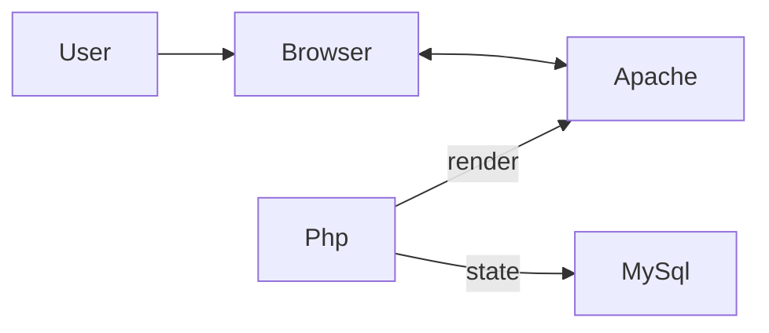

# LAMP Trivia Quiz

This is an example web application to showcase
the [LAMP stack](https://en.wikipedia.org/wiki/LAMP_(software_bundle)).
It's the classical Trivia Quiz based on [Open Trivia DB](https://opentdb.com/).

## Motivation

Nowadays JavaScript frameworks like React, Vue or Angular are pretty much the
standard of frontend development for web applications.
But why do we need them?
What feature do they add on top of the browser capabilities?

This repository is part of a study to answer this question.
The idea is to see how far one can go without frameworks by developing a small
application.

## Architecture

In this repository I am working with the following constrains:

- The application uses no JavaScript at all.
- All the HTML pages are rendered on the server.
- The application state is persisted in a relational database.

I'm using the [LAMP stack](https://en.wikipedia.org/wiki/LAMP_(software_bundle)),
which was popular during the early 2000s at the beginning my career.
This means I'm using [PhP](https://www.php.net/) to render HTML on the server
and [MySql](https://www.mysql.com/) to persist the state of the application.

There are similar alternatives, like using [django](https://www.djangoproject.com/)
with Python, [Ruby on Rails](https://rubyonrails.org/),
or [Razor](https://learn.microsoft.com/en-us/aspnet/core/tutorials/razor-pages/razor-pages-start?view=aspnetcore-7.0&tabs=visual-studio)
with .Net.

**Important** This repository is a learning experiment.
This is not the typical architecture of a modern web application.
I do not recommend you to use it in a serious project!

--

- Frontend and backend code is not separated.
- Almost no logic on the frontend.
- The state is all in the database. Even if it is transient.
- Session management
- Can't use browser API.

## How to use

Start the images with docker compose

    docker compose up

Put your php files in the `./approot` folder and access them from your browser.

For example the file `info.php` outputs information about the enviroment
(in the container) and you can access that through the link
<http://localhost/info.php> once the server is started.

## 3rd party

The migration [Dockerfile](migrations/Dockerfile) and
[script](migrations/migrate.sh) are adapted from
[this repository](https://github.com/mathew-hall/mysql_migration).
